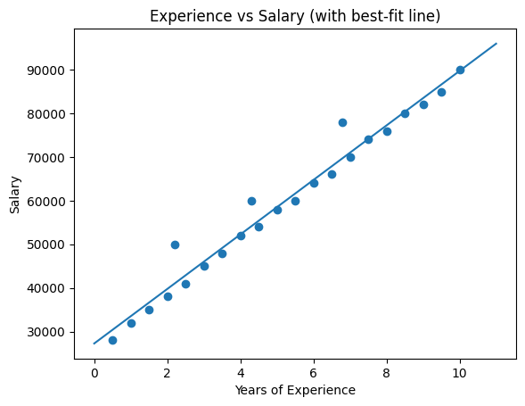

# ai-01-linear-regression — Salary Prediction (Week 1)

> Beginner-friendly ML project: predict salary from years of experience using a simple Linear Regression.
> Status: Week 1 release (v0.1.0)

## Goals
- Learn Python basics for data science (pandas, numpy)
- Explore data (EDA) and visualize relationships
- Train a baseline linear regression
- Evaluate with MAE/MSE/R2
- Save figures and document results like a Software Engineer (README, folders, simple scripts)

## Project Structure
```
ai-01-linear-regression/
├─ data/
│  ├─ raw/               # original CSV (e.g., salary.csv)
│  └─ processed/         # cleaned/derived files
├─ notebooks/
│  └─ 01_salary_regression.ipynb
├─ reports/
│  └─ figures/           # saved plots (scatter, line-fit, residuals, etc.)
├─ src/
│  ├─ data.py            # optional helpers to load/process data
│  └─ model.py           # optional training helpers
├─ artifacts/            # saved model + metrics JSON
├─ scripts/
│  └─ train.py           # (optional) run training from CLI
├─ README.md
└─ pyproject.toml / requirements.txt (choose one approach)
```

## Setup (Windows and Mac/Linux)
Requires Python 3.11+

Windows PowerShell
```powershell
python -m venv .venv
.\.venv\Scripts\activate
pip install -U pip
pip install pandas numpy scikit-learn jupyter matplotlib joblib
```

Mac/Linux
```bash
python -m venv .venv
source .venv/bin/activate
pip install -U pip
pip install pandas numpy scikit-learn jupyter matplotlib joblib
```

## How to Run
Option A — Jupyter Notebook
```bash
jupyter notebook
# open notebooks/01_salary_regression.ipynb and run cells in order
```

Option B — Script (optional)
```bash
python scripts/train.py
# saves: artifacts/model.joblib and artifacts/metrics.json
```

## Results (replace with your actual numbers)
- R2: 0.89  (how much variance is explained; higher is better, max 1.0)
- MAE: 3500 (average absolute error in salary units; lower is better)
- MSE: 18500000 (squared error; lower is better)

Put your real numbers after running the notebook or scripts/train.py.

## Figures
Add screenshots/plots you created to reports/figures/, then reference them here:

- reports/figures/scatter_experience_salary.png
- reports/figures/line_fit.png
- reports/figures/residuals.png
- reports/figures/learning_curve.png

Example Markdown embed:

```markdown

```

## Metrics & Code Snippets
Training and metrics (example):
```python
import json
import pandas as pd
from sklearn.model_selection import train_test_split, cross_val_score
from sklearn.linear_model import LinearRegression
from sklearn.metrics import mean_absolute_error, mean_squared_error, r2_score

df = pd.read_csv("data/raw/salary.csv")
X = df[["years_experience"]]
y = df["salary"]

X_train, X_test, y_train, y_test = train_test_split(X, y, test_size=0.2, random_state=42)

model = LinearRegression()
model.fit(X_train, y_train)
pred = model.predict(X_test)

mae = mean_absolute_error(y_test, pred)
mse = mean_squared_error(y_test, pred)
r2  = r2_score(y_test, pred)

with open("artifacts/metrics.json", "w") as f:
    json.dump({"MAE": mae, "MSE": mse, "R2": r2}, f, indent=2)
print({"MAE": mae, "MSE": mse, "R2": r2})
```

## What I Learned (Week 1)
- How to set up Python + virtual envs
- Basic EDA with pandas and matplotlib
- Why baseline models matter
- How to read MAE/MSE/R2
- Saving figures + writing a clear README

## Next Steps
- Try cross-validation (KFold)
- Add a tiny CLI (scripts/train.py)
- Make the repo reproducible (requirements.txt or pyproject.toml)
